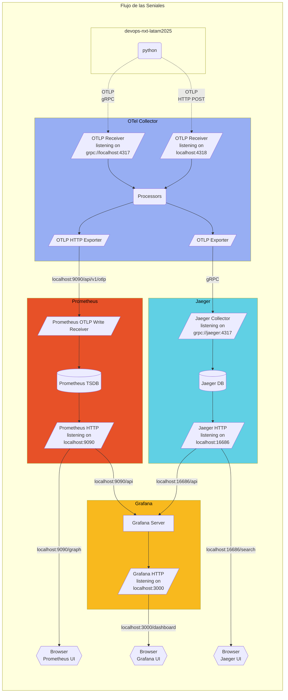

# kcd-workshop2025-observabilidad
KCD Colombia - Observabilidad: El eslabón perdido en la evolución DevOps que transformará tu carrera

> [LinkedIn JhonnyPong](https://www.linkedin.com/in/jhonnypong/)  
> [Youtube](https://www.youtube.com/c/jthan24-espa%C3%B1ol/)  
> [Comunidad de Whatsapp](https://whatsapp.com/channel/0029Vae3YN5ICVfrBrMkit2I)

# Diagrama 

# Referencia
- https://opentelemetry.io/docs/languages/python/getting-started/
- https://opentelemetry.io/docs/demo/
- https://opentelemetry.io/docs/demo/architecture/

